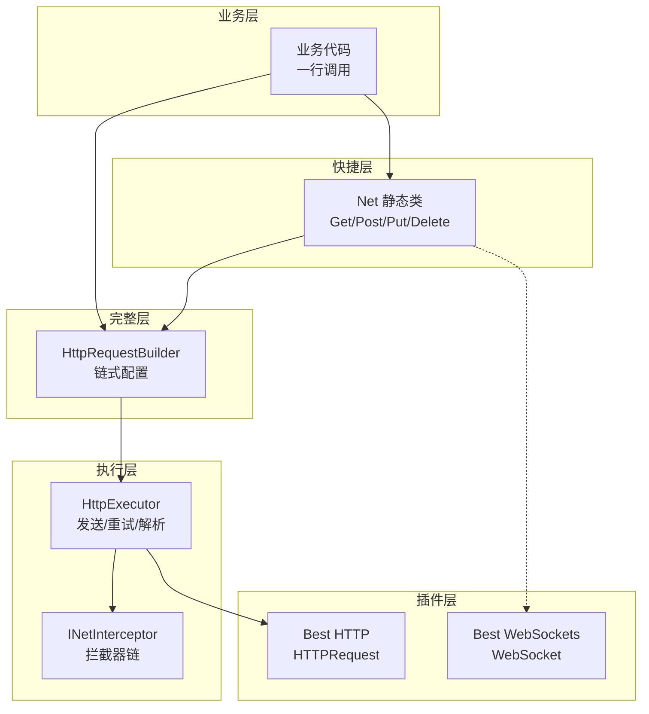

# 网络模块（NetworkModule）

<cite>
**本文引用的文件**
- [Net.cs](file://Assets/GameScripts/HotFix/GameLogic/Module/NetworkModule/Net.cs)
- [HttpRequestBuilder.cs](file://Assets/GameScripts/HotFix/GameLogic/Module/NetworkModule/Http/HttpRequestBuilder.cs)
- [HttpExecutor.cs](file://Assets/GameScripts/HotFix/GameLogic/Module/NetworkModule/Http/HttpExecutor.cs)
- [WsClient.cs](file://Assets/GameScripts/HotFix/GameLogic/Module/NetworkModule/WebSocket/WsClient.cs)
- [NetworkConfig.cs](file://Assets/GameScripts/HotFix/GameLogic/Module/NetworkModule/Common/NetworkConfig.cs)
- [ApiRoutes.cs](file://Assets/GameScripts/HotFix/GameLogic/Module/NetworkModule/ApiRoutes.cs)
- [INetInterceptor.cs](file://Assets/GameScripts/HotFix/GameLogic/Module/NetworkModule/Common/INetInterceptor.cs)
- [NetError.cs](file://Assets/GameScripts/HotFix/GameLogic/Module/NetworkModule/Common/NetError.cs)
- [NetLog.cs](file://Assets/GameScripts/HotFix/GameLogic/Module/NetworkModule/Common/NetLog.cs)
</cite>

## 目录
1. [简介](#简介)
2. [架构总览](#架构总览)
3. [快速开始](#快速开始)
4. [HTTP 请求](#http-请求)
5. [WebSocket](#websocket)
6. [环境管理](#环境管理)
7. [拦截器](#拦截器)
8. [错误处理](#错误处理)
9. [日志系统](#日志系统)
10. [API 路由管理](#api-路由管理)
11. [最佳实践](#最佳实践)
12. [故障排查](#故障排查)

## 简介

网络模块基于 [Best HTTP](https://github.com/nicengi/BestHTTP) 和 [Best WebSockets](https://github.com/nicengi/BestHTTP) 插件封装，提供两层 API 设计：

- **快捷层**：一行代码完成请求，覆盖 80% 日常场景
- **完整层**：Builder 链式调用，支持细粒度控制（自定义超时、重试、Header、进度回调等）

核心特性：
- 全异步（UniTask），零 Coroutine
- 统一错误处理（三层机制：拦截器 → 全局回调 → 调用点）
- 多环境切换（Dev / Staging / Production）
- 拦截器链（Token 注入、签名、日志）
- 内置日志与慢请求告警
- WebSocket 自动重连

## 架构总览



**图表来源**
- [Net.cs:1-210](file://Assets/GameScripts/HotFix/GameLogic/Module/NetworkModule/Net.cs#L1-L210)
- [HttpExecutor.cs:1-50](file://Assets/GameScripts/HotFix/GameLogic/Module/NetworkModule/Http/HttpExecutor.cs#L1-L50)

## 快速开始

### 初始化

在 `GameApp` 启动流程中调用一次：

```csharp
// 方式1：自动检测环境（推荐）
Net.Init();

// 方式2：指定环境
Net.Init(ServerEnvironment.Production);

// 方式3：完整配置
Net.Init(new NetworkConfig
{
    Environment = ServerEnvironment.Production,
    ProductionBaseUrl = "https://api.mygame.com",
    DefaultTimeout = 15f,
});

// 注册全局错误处理
Net.OnError += OnNetworkError;

// 注册拦截器
Net.AddInterceptor(new AuthInterceptor());
```

### 一行请求

```csharp
// POST + JSON → 拿数据
var user = await Net.Post<LoginResp>(ApiRoutes.User.Login, new { account, password });

// GET + Query 参数
var levels = await Net.Get<List<LevelInfo>>(ApiRoutes.Level.List, new { page = 1, size = 20 });

// GET + 路径参数
var detail = await Net.Get<LevelDetail>(ApiRoutes.Level.Detail, ("id", levelId.ToString()));

// 不关心返回
await Net.PostVoid(ApiRoutes.Level.Complete, saveData);
```

**章节来源**
- [Net.cs:60-100](file://Assets/GameScripts/HotFix/GameLogic/Module/NetworkModule/Net.cs#L60-L100)

## HTTP 请求

### 请求方式一览

| 方式 | Content-Type | Builder 方法 | 场景 |
|------|-------------|-------------|------|
| JSON Body | `application/json` | `.WithJson(obj)` | 大部分 API |
| URL Query | 无 body | `.WithQuery(k, v)` 或 Get 第二参数 | GET 查询 |
| Raw Binary | `application/octet-stream` | `.WithRawBody(bytes)` | Protobuf / 自定义协议 |
| 路径参数 | — | `.WithPathArg(k, v)` 或快捷层 tuple | `/api/levels/{id}` |

### 快捷层 API

```csharp
Net.Get<T>(path, query?, ct?)          // GET 请求
Net.Post<T>(path, body?, ct?)          // POST 请求
Net.Put<T>(path, body?, ct?)           // PUT 请求
Net.Delete<T>(path, body?, ct?)        // DELETE 请求
Net.PostVoid(path, body?, ct?)         // POST 不关心返回
Net.PostFull<T>(path, body?, ct?)      // POST 返回完整响应
Net.Upload<T>(path, bytes, name, ct?)  // 文件上传
```

### 完整层 API（Builder）

```csharp
var resp = await Net.Request()
    .Post(ApiRoutes.User.Login)
    .WithJson(body)
    .WithHeader("X-Device-Id", deviceId)
    .WithTimeout(30f)
    .WithRetry(5)
    .WithProgress(p => loadingBar.value = p)
    .ThrowOnError()
    .SendAsync<LoginResp>(ct);
```

### 响应解析

| 方法 | 返回类型 | 说明 |
|------|---------|------|
| `SendAsync<T>()` | `UniTask<T>` | JSON → T（自动解包 ServerResponse） |
| `SendAsStringAsync()` | `UniTask<string>` | 原始字符串 |
| `SendAsRawAsync()` | `UniTask<byte[]>` | 原始字节 |
| `SendFullAsync<T>()` | `UniTask<NetResponse<T>>` | 完整响应（含 Header、状态码、错误） |

**章节来源**
- [HttpRequestBuilder.cs:1-170](file://Assets/GameScripts/HotFix/GameLogic/Module/NetworkModule/Http/HttpRequestBuilder.cs#L1-L170)
- [HttpExecutor.cs:15-50](file://Assets/GameScripts/HotFix/GameLogic/Module/NetworkModule/Http/HttpExecutor.cs#L15-L50)

## WebSocket

### 连接与使用

```csharp
// 连接（一行）
var ws = await Net.ConnectWs(ApiRoutes.Ws.Game);

// 发送消息（自动序列化）
ws.Send(new { type = "ready", roomId = 123 });

// 发送二进制
ws.SendBinary(protobufBytes);

// 接收消息（按 type 路由）
ws.On<GameStartMsg>("game_start", msg => { /* 处理 */ });
ws.On<ChatMsg>("chat", msg => { /* 处理 */ });

// 通用消息监听
ws.OnMessage += (json) => { /* 所有文本消息 */ };
ws.OnBinary += (bytes) => { /* 所有二进制消息 */ };

// 连接事件
ws.OnConnected += () => { };
ws.OnDisconnected += (code, reason) => { };
ws.OnError += (error) => { };

// 关闭
await ws.CloseAsync();
// 或销毁
ws.Dispose();
```

### 自动重连

默认开启自动重连（指数退避），可配置：

```csharp
var ws = Net.CreateWs(ApiRoutes.Ws.Game, autoReconnect: true);
await ws.ConnectAsync(ct);
```

异常断开时自动重连，最多 10 次，间隔递增（2s → 4s → 6s → ... → 10s）。

**章节来源**
- [WsClient.cs:1-220](file://Assets/GameScripts/HotFix/GameLogic/Module/NetworkModule/WebSocket/WsClient.cs#L1-L220)

## 环境管理

### 配置结构

```csharp
public class NetworkConfig
{
    public ServerEnvironment Environment;
    public string DevBaseUrl;
    public string StagingBaseUrl;
    public string ProductionBaseUrl;
    public string DevWsUrl;
    public string StagingWsUrl;
    public string ProductionWsUrl;
    public float DefaultTimeout = 15f;
    public int DefaultRetryCount = 2;
}
```

### 切换方式

| 方式 | 代码 | 场景 |
|------|------|------|
| 自动检测 | `Net.Init()` | 根据编译宏自动选择 |
| 指定环境 | `Net.Init(ServerEnvironment.Staging)` | 构建流程指定 |
| 运行时切换 | `Net.SwitchEnv(ServerEnvironment.Dev)` | GM 面板调试 |

业务代码只写相对路径，BaseUrl 由 Net 自动拼接，环境切换对业务完全透明。

**章节来源**
- [NetworkConfig.cs:1-60](file://Assets/GameScripts/HotFix/GameLogic/Module/NetworkModule/Common/NetworkConfig.cs#L1-L60)

## 拦截器

### 接口定义

```csharp
public interface INetInterceptor
{
    void OnBeforeRequest(NetRequestContext ctx);
    UniTask<bool> OnError(NetRequestContext ctx, NetError error);
}
```

### 典型实现：Token 自动注入

```csharp
public class AuthInterceptor : INetInterceptor
{
    public void OnBeforeRequest(NetRequestContext ctx)
    {
        if (!string.IsNullOrEmpty(TokenManager.AccessToken))
            ctx.SetHeader("Authorization", $"Bearer {TokenManager.AccessToken}");
    }

    public async UniTask<bool> OnError(NetRequestContext ctx, NetError error)
    {
        if (error.Type != NetErrorType.Unauthorized) return false;

        bool refreshed = await TokenManager.RefreshAsync();
        if (!refreshed) return false;

        ctx.SetHeader("Authorization", $"Bearer {TokenManager.AccessToken}");
        ctx.MarkRetry();
        return true;
    }
}
```

### 注册

```csharp
Net.AddInterceptor(new AuthInterceptor());
Net.AddInterceptor(new LogInterceptor());
```

**章节来源**
- [INetInterceptor.cs:1-20](file://Assets/GameScripts/HotFix/GameLogic/Module/NetworkModule/Common/INetInterceptor.cs#L1-L20)

## 错误处理

### 三层机制

```
请求失败
  ↓
第1层：拦截器 OnError() → 可修复（如刷新 Token 后重试）
  ↓ 未处理
第2层：全局 Net.OnError → 统一 UI 提示 + 埋点上报
  ↓
第3层：调用点 → Silent 返回 null / Throw 抛异常
```

### 全局错误处理（推荐）

```csharp
Net.OnError += (error) =>
{
    switch (error.Type)
    {
        case NetErrorType.NetworkUnreachable:
            ToastUI.Show("网络不可用"); break;
        case NetErrorType.RequestTimeout:
            ToastUI.Show("请求超时"); break;
        case NetErrorType.Unauthorized:
            GameModule.UI.ShowUIAsync<LoginUI>(); break;
        case NetErrorType.ServerError:
            ToastUI.Show("服务器开小差了"); break;
        case NetErrorType.BusinessError:
            ToastUI.Show(error.Message); break;
    }

    // 埋点上报
    AnalyticsModule.ReportNetError(error);
};
```

### 业务层介入（可选）

```csharp
// 方式A：Silent 模式（默认），失败返回 null
var data = await Net.Post<LoginResp>(ApiRoutes.User.Login, req);
if (data == null) return; // 全局已处理

// 方式B：需要完整响应时
var resp = await Net.PostFull<LoginResp>(ApiRoutes.User.Login, req);
if (!resp.IsSuccess && resp.Error.BusinessCode == 10001)
    ShowBannedDialog();

// 方式C：单个请求使用 Throw 模式
try {
    var data = await Net.Request().Post(path).WithJson(body).ThrowOnError().SendAsync<T>();
} catch (NetException ex) { /* 自定义处理 */ }
```

**章节来源**
- [NetError.cs:1-95](file://Assets/GameScripts/HotFix/GameLogic/Module/NetworkModule/Common/NetError.cs#L1-L95)
- [HttpExecutor.cs:100-160](file://Assets/GameScripts/HotFix/GameLogic/Module/NetworkModule/Http/HttpExecutor.cs#L100-L160)

## 日志系统

### 日志级别

| 级别 | 输出内容 | 默认环境 |
|------|---------|---------|
| Error | 请求失败、超时、反序列化异常 | Release |
| Warn | 重试、慢请求 | — |
| Info | 每个请求摘要（方法+路径+状态码+耗时） | Development |
| Debug | 请求/响应 Body（截断 500 字符） | Editor |
| Verbose | 完整 Header、Cookie | — |

### 配置

```csharp
Net.LogLevel = NetLogLevel.Debug;          // 手动设置
Net.SlowRequestThreshold = 3f;            // 慢请求阈值（秒）
```

### 输出格式

```
[Net] POST /api/user/login → 200 (342ms)
[Net][WARN] Slow: GET /api/levels took 4521ms (threshold: 3000ms)
[Net][ERR] POST /api/user/login → Timeout after 15000ms
[Net][WS] Connected wss://api.game.com/ws/game
[Net][WS] ← recv: {"type":"game_start"}
```

Unity Console 中搜索 `[Net]` 即可过滤所有网络日志。

### 敏感数据脱敏

Debug 日志自动脱敏 password、token、secret、authorization 字段。

**章节来源**
- [NetLog.cs:1-80](file://Assets/GameScripts/HotFix/GameLogic/Module/NetworkModule/Common/NetLog.cs#L1-L80)

## API 路由管理

所有 API 路径集中定义在 `ApiRoutes` 静态类中，按业务模块分组：

```csharp
public static class ApiRoutes
{
    public static class User
    {
        public const string Login = "/api/v1/user/login";
        public const string Profile = "/api/v1/user/profile";
    }

    public static class Level
    {
        public const string List = "/api/v1/levels";
        public const string Detail = "/api/v1/levels/{id}";
    }

    public static class Ws
    {
        public const string Game = "/ws/game";
    }
}
```

路径参数 `{id}` 在请求时自动替换：

```csharp
var detail = await Net.Get<LevelDetail>(ApiRoutes.Level.Detail, ("id", "123"));
// 实际请求：GET https://api.game.com/api/v1/levels/123
```

**章节来源**
- [ApiRoutes.cs:1-40](file://Assets/GameScripts/HotFix/GameLogic/Module/NetworkModule/ApiRoutes.cs#L1-L40)

## 最佳实践

1. **业务代码不出现硬编码 URL**：所有路径定义在 `ApiRoutes`
2. **不手动处理错误**：90% 场景依赖全局 `Net.OnError`，只在特殊业务逻辑时用 `PostFull`
3. **传递 CancellationToken**：UI 销毁时取消请求，防止回调执行在已销毁对象上
4. **WebSocket 用 Dispose**：在持有 WsClient 的对象销毁时调用 `ws.Dispose()`
5. **新增 API 时**：先在 `ApiRoutes` 添加路径常量，再在业务中调用

### CancellationToken 使用

```csharp
public class MyUI : UIWindow
{
    private CancellationTokenSource _cts = new();

    protected override async void OnCreate()
    {
        var data = await Net.Get<MyData>(ApiRoutes.User.Profile, ct: _cts.Token);
        if (data == null) return;
        // 使用 data...
    }

    protected override void OnDestroy()
    {
        _cts.Cancel();
        _cts.Dispose();
    }
}
```

## 故障排查

| 问题 | 排查方向 |
|------|---------|
| 请求无响应 | 检查 `Net.Init()` 是否调用；检查 BaseUrl 配置 |
| 401 频繁出现 | 检查 AuthInterceptor 是否注册；Token 刷新逻辑是否正确 |
| 反序列化失败 | 开启 `NetLogLevel.Debug` 查看原始响应；检查 ServerResponse 格式是否匹配 |
| WebSocket 频繁断开 | 检查服务器心跳配置；查看 `[Net][WS]` 日志中的断开原因码 |
| 慢请求告警 | 检查服务器响应时间；考虑增加超时或优化接口 |
| 编译错误 | 确认 GameLogic.asmdef 已添加 Best HTTP / Best WebSockets 引用 |

**章节来源**
- [Net.cs:1-210](file://Assets/GameScripts/HotFix/GameLogic/Module/NetworkModule/Net.cs#L1-L210)
- [HttpExecutor.cs:1-260](file://Assets/GameScripts/HotFix/GameLogic/Module/NetworkModule/Http/HttpExecutor.cs#L1-L260)
